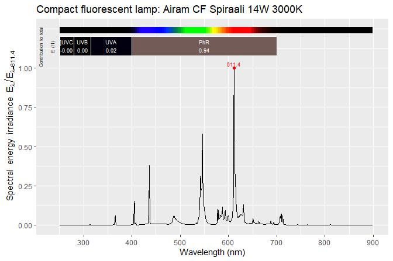

# photobiologyLamps

[](https://cran.r-project.org/package=photobiologyLamps)
[](https://cran.r-project.org/web/checks/check_results_photobiologyLamps.html)

Package ‘**photobiologyLamps**’ is a data-only R package containing
spectral emission data for diverse types of lamps, while data for LEDs
sold as electronic components are included in package
‘**photobiologyLEDs**’.

The data in this package are stored in objects of classes defined in
package ‘**photobiology**’ which are mostly backwards compatible with
data frames.

This package is part of a suite of R packages for photobiological
calculations described at the
[r4photobiology](https://www.r4photobiology.info) web site.

## Examples

The first example shows you how to plot the emission spectrum of one of
the lamps.

``` r
library(ggspectra)
library(photobiologyLamps)
plot(lamps.mspct$airam.spiraali,
     annotations = c("+", "title:what"))
```

<!-- -->

The second example shows how to access metadata.

``` r
getWhatMeasured(lamps.mspct$airam.spiraali)
#> [1] "Airam Spiraali 14W 220-240W 3000K E27 900 lm CRI>=80"
```

## Installation

Installation of the most recent stable version from CRAN:

``` r
install.packages("photobiologyLamps")
```

Installation of the current unstable version from Bitbucket:

``` r
# install.packages("devtools")
devtools::install_bitbucket("aphalo/photobiologylamps")
```

## Documentation

HTML documentation is available at
(<https://docs.r4photobiology.info/photobiologyLamps/>), including a
*User Guide*.

News on updates to the different packages of the ‘r4photobiology’ suite
are regularly posted at (<https://www.r4photobiology.info/>).

Two articles introduce the basic ideas behind the design of the suite
and describe its use: Aphalo P. J. (2015)
(<https://doi.org/10.19232/uv4pb.2015.1.14>) and Aphalo P. J. (2016)
(<https://doi.org/10.19232/uv4pb.2016.1.15>).

A book is under preparation, and the draft is currently available at
(<https://leanpub.com/r4photobiology/>).

A handbook written before the suite was developed contains useful
information on the quantification and manipulation of ultraviolet and
visible radiation: Aphalo, P. J., Albert, A., Björn, L. O., McLeod, A.
R., Robson, T. M., & Rosenqvist, E. (Eds.) (2012) Beyond the Visible: A
handbook of best practice in plant UV photobiology (1st ed., p. xxx +
174). Helsinki: University of Helsinki, Department of Biosciences,
Division of Plant Biology. ISBN 978-952-10-8363-1 (PDF),
978-952-10-8362-4 (paperback). PDF file available from
(<https://hdl.handle.net/10138/37558>).

## Contributing

Pull requests, bug reports, and feature requests are welcome at
(<https://bitbucket.org/aphalo/photobiology>).

## Citation

If you use this package to produce scientific or commercial
publications, please cite according to:

``` r
citation("photobiologyLamps")
#> 
#> To cite package 'photobiologyLamps' in publications, please use:
#> 
#>   Aphalo, Pedro J. (2015) The r4photobiology suite. UV4Plants
#>   Bulletin, 2015:1, 21-29. DOI:10.19232/uv4pb.2015.1.14
#> 
#> A BibTeX entry for LaTeX users is
#> 
#>   @Article{,
#>     author = {Pedro J. Aphalo},
#>     title = {The r4photobiology suite},
#>     journal = {UV4Plants Bulletin},
#>     volume = {2015},
#>     number = {1},
#>     pages = {21-29},
#>     year = {2015},
#>     doi = {10.19232/uv4pb.2015.1.14},
#>   }
```

## License

© 2013-2019 Pedro J. Aphalo (<pedro.aphalo@helsinki.fi>). Released under
the GPL, version 2 or greater. This software carries no warranty of any
kind.
